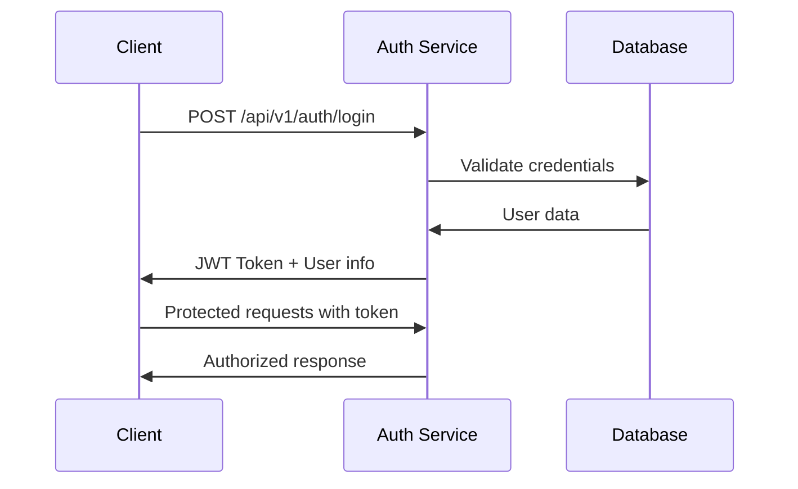

# 🩺 Smart-Doc
**Next-Generation Healthcare Booking Platform**

[](https://opensource.org/licenses/MIT)
[](https://angular.io/)
[](https://spring.io/projects/spring-boot)
[](https://postgresql.org/)

**Smart-Doc** is a cutting-edge healthcare booking platform that revolutionizes how patients connect with healthcare professionals. Built with modern technology stack and a patient-first approach, it provides a seamless ecosystem for booking and managing medical appointments while empowering doctors with efficient practice management tools.

> **Making healthcare faster, smarter, and more accessible for everyone.**

---

## 🌟 Why Choose Smart-Doc?

### For Patients
- 🔍 **Effortless Discovery:** Find the right doctor by specialty, location, and availability
- 📅 **Instant Booking:** Schedule appointments with just a few clicks
- ⏰ **Smart Reminders:** Never miss an appointment with automated notifications
- 📱 **Mobile-First:** Responsive design that works perfectly on all devices

### For Healthcare Professionals
- 🗂️ **Practice Management:** Streamline your schedule with intelligent tools
- 👥 **Patient Engagement:** Build stronger relationships with your patients
- 📊 **Analytics Dashboard:** Track appointments, reviews, and practice growth
- 💼 **Professional Profile:** Showcase credentials, specialties, and patient reviews

---

## ✨ Key Features

| Feature | Description |
|---------|-------------|
| 🔍 **Advanced Doctor Search** | Filter by specialty, location, insurance, ratings, and availability |
| 📅 **Real-time Booking** | Instant appointment scheduling with calendar integration |
| 👩‍⚕️ **Comprehensive Profiles** | Detailed doctor information with credentials and patient reviews |
| 🔔 **Smart Notifications** | Automated reminders via email |
| 📱 **Multi-platform Support** | Web, mobile, and tablet optimized experience |

---

## 🛠️ Technology Stack

### Frontend
```
🎨 Framework: Angular 19 + NgRx
🎯 State Management: NgRx Store/Effects
💅 Styling: Tailwind CSS + Angular Material
📱 Responsive: Mobile-first design approach
```

### Backend
```
☕ Framework: Spring Boot 3.x
🔐 Security: Spring Security + JWT
🗄️ Database: PostgreSQL 15+
📡 API: RESTful with OpenAPI
```

### DevOps & Tools
```
🐳 Containerization: Docker + Docker Compose
📋 API Docs: OpenAPI 3.0
🧪 Testing: Jest + JUnit + Testcontainers
🔄 CI/CD: GitHub Actions ready
```

---

## 🏗️ System Architecture

```
┌─────────────────┐    ┌──────────────────┐    ┌─────────────────┐
│   Angular App   │◄──►│ Spring Boot API  │◄──►│   PostgreSQL    │
│  (NgRx Store)   │    │ (REST Endpoints) │    │ (Data Storage)  │
└─────────────────┘    └──────────────────┘    └─────────────────┘
         │                        │                        │
    ┌────▼────┐              ┌────▼────┐              ┌────▼────┐
    │UI/UX    │              │Business │              │Database │
    │Layer    │              │Logic    │              │Schema   │
    │         │              │         │              │         │
    │• Search │              │• Auth   │              │• Users  │
    │• Booking│              │• Booking│              │• Doctors│
    │• Reviews│              │• Notifications         │• Appointments│
    └─────────┘              └─────────┘              └─────────┘
```

**Architecture Components:**
- **Angular Frontend:** Manages UI, routing, and state with NgRx
- **Spring Boot Backend:** Provides secure REST APIs and business logic
- **PostgreSQL Database:** Stores all application data with ACID compliance
- **JWT Authentication:** Stateless security for scalability
---

## 📂 Project Structure

```
smart-doc/
├── 📁 frontend/                    # Angular Application
│   ├── 📁 src/
│   │   ├── 📁 app/
│   │   │   ├── 📁 core/            # Core services & guards
│   │   │   ├── 📁 shared/          # Shared components & utilities
│   │   │   ├── 📁 features/        # Feature modules
│   │   │   │   ├── 📁 auth/        # Authentication
│   │   │   │   ├── 📁 doctors/     # Doctor management
│   │   │   │   ├── 📁 appointments/# Booking system
│   │   │   │   ├── 📁 patients/    # Patient profiles
│   │   │   │   └── 📁 dashboard/   # Admin dashboard
│   │   │   ├── 📁 layout/          # Layout components
│   │   │   └── 📁 store/           # NgRx store config
│   │   ├── 📁 assets/              # Static assets
│   │   └── 📁 environments/        # Environment configs
│   ├── 📄 package.json
│   ├── 📄 angular.json
│   └── 📄 tailwind.config.js
│
├── 📁 backend/                     # Spring Boot Application
│   ├── 📁 src/
│   │   ├── 📁 main/java/com/smartdoc/
│   │   │   ├── 📁 config/          # Configuration classes
│   │   │   ├── 📁 controller/      # REST Controllers
│   │   │   ├── 📁 service/         # Business logic
│   │   │   ├── 📁 repository/      # Data access layer
│   │   │   ├── 📁 entity/          # JPA Entities
│   │   │   ├── 📁 dto/             # Data transfer objects
│   │   │   ├── 📁 security/        # Security components
│   │   │   └── 📁 exception/       # Exception handling
│   │   └── 📁 resources/
│   │       ├── 📄 application.yml  # Main config
│   │       └── 📁 db/migration/    # Database migrations
│   ├── 📄 pom.xml
│   └── 📄 Dockerfile
│
├── 📁 docs/                        # Documentation
│   ├── 📄 API.md                   # API documentation
│   ├── 📄 CONTRIBUTING.md          # Contribution guidelines
│   └── 📁 diagrams/                # Architecture diagrams
│
├── 📁 docker/                      # Docker configurations
│   ├── 📄 docker-compose.yml       # Local development
│   ├── 📄 docker-compose.prod.yml  # Production setup
│   └── 📄 nginx.conf               # Reverse proxy config
│
├── 📄 README.md                    # This file
├── 📄 LICENSE                      # MIT License
└── 📄 .gitignore                   # Git ignore rules
```

---

## 🚀 Quick Start Guide

### Prerequisites
Ensure you have the following installed:
- **Node.js** 18+ and npm
- **Java** 17+ and Maven 3.8+
- **PostgreSQL** 15+
- **Docker** and Docker Compose (optional)
- **Git** for version control

### Option 1: Manual Setup

#### 1. Clone the Repository
```bash
git clone https://github.com/your-username/smart-doc.git
cd smart-doc
```

#### 2. Database Setup
```bash
# Create PostgreSQL database
createdb smartdoc

# Or using PostgreSQL CLI
psql -c "CREATE DATABASE smartdoc;"
```

#### 3. Backend Setup
```bash
cd backend

# Configure database connection in application.yml
# Update the following properties:
# spring.datasource.url=jdbc:postgresql://localhost:5432/smartdoc
# spring.datasource.username=your_username
# spring.datasource.password=your_password

# Install dependencies and run
mvn clean install
mvn spring-boot:run
```

Backend server will start at: **http://localhost:8080**

#### 4. Frontend Setup
```bash
cd ../frontend

# Install dependencies
npm install

# Start development server
npm start
```

Frontend application will start at: **http://localhost:4200**

### Option 2: Docker Setup (Recommended)

#### Quick Start with Docker Compose
```bash
# Clone and start everything with one command
git clone https://github.com/your-username/smart-doc.git
cd smart-doc
docker-compose up --build
```

**Services will be available at:**
- Frontend: **http://localhost:4200**
- Backend API: **http://localhost:8080**
- PostgreSQL: **localhost:5432**

#### Production Deployment
```bash
# Use production docker-compose configuration
docker-compose -f docker-compose.prod.yml up -d
```

---

### Authentication Flow


### Sample API Requests

**User Registration:**
```bash
curl -X POST http://localhost:8080/api/v1/auth/register \
  -H "Content-Type: application/json" \
  -d '{
    "firstName": "John",
    "lastName": "Doe",
    "email": "john.doe@example.com",
    "password": "SecurePassword123",
    "role": "PATIENT"
  }'
```

**Book Appointment:**
```bash
curl -X POST http://localhost:8080/api/v1/appointments \
  -H "Content-Type: application/json" \
  -H "Authorization: Bearer YOUR_JWT_TOKEN" \
  -d '{
    "doctorId": 123,
    "appointmentDate": "2024-12-15T10:00:00",
    "reason": "Regular checkup",
    "notes": "First time visit"
  }'
```

---

## 🧪 Testing

### Frontend Testing
```bash
cd frontend

# Run unit tests
npm test

# Run end-to-end tests
npm run e2e

# Generate coverage report
npm run test:coverage
```

### Backend Testing
```bash
cd backend

# Run all tests
mvn test

# Run integration tests
mvn verify

# Generate test report
mvn surefire-report:report
```

### Test Coverage Goals
- **Unit Tests:** > 80% coverage
- **Integration Tests:** All API endpoints
- **E2E Tests:** Critical user journeys

---

## 🚀 Deployment

### Environment Configuration

#### Development
```yaml
# application-dev.yml
spring:
  datasource:
    url: jdbc:postgresql://localhost:5432/smartdoc_dev
  jpa:
    show-sql: true
    hibernate:
      ddl-auto: update

logging:
  level:
    com.smartdoc: DEBUG
```

#### Production
```yaml
# application-prod.yml
spring:
  datasource:
    url: ${DATABASE_URL}
  jpa:
    hibernate:
      ddl-auto: validate

server:
  port: 8080
  
security:
  jwt:
    expiration: 86400000 # 24 hours
```

### Docker Production Deployment
```bash
# Build production images
docker build -t smartdoc-frontend ./frontend
docker build -t smartdoc-backend ./backend

# Deploy with docker-compose
docker-compose -f docker-compose.prod.yml up -d

# Check deployment status
docker-compose ps
```

### Cloud Deployment Options
- **AWS:** ECS, EC2, RDS PostgreSQL
- **Google Cloud:** Cloud Run, Cloud SQL
- **Azure:** Container Instances, Azure Database
- **Heroku:** Easy deployment with Heroku Postgres

---

## 🤝 Contributing

We welcome contributions from the community! Here's how you can help:

### Getting Started
1. **Fork** the repository
2. **Clone** your fork locally
3. **Create** a feature branch: `git checkout -b feature/amazing-feature`
4. **Make** your changes
5. **Test** thoroughly
6. **Commit** with clear messages: `git commit -m 'Add amazing feature'`
7. **Push** to your fork: `git push origin feature/amazing-feature`
8. **Create** a Pull Request

### Development Guidelines

#### Code Standards
- **Frontend:** Follow Angular style guide
- **Backend:** Follow Spring Boot best practices
- **Database:** Use proper naming conventions
- **Testing:** Write tests for new features

#### Commit Message Format
```
type(scope): subject

body (optional)

footer (optional)
```

**Types:** feat, fix, docs, style, refactor, test, chore

**Example:**
```
feat(appointments): add appointment reminder notifications

- Implement email notification service
- Add SMS notification support
- Create notification preferences UI
- Add comprehensive test coverage

Closes #123
```

### Areas We Need Help
- 🎨 **UI/UX Design:** Improve user interface and experience
- 🔧 **Backend Features:** New API endpoints and services
- 📱 **Mobile App:** React Native or Flutter implementation
- 🧪 **Testing:** Increase test coverage
- 📚 **Documentation:** API docs, user guides
- 🌍 **Internationalization:** Multi-language support
- ♿ **Accessibility:** WCAG compliance improvements

---

## 📋 Roadmap

### Version 1.0 (Current)
- ✅ User authentication and profiles
- ✅ Doctor search and profiles
- ✅ Basic appointment booking
- ✅ Admin dashboard

### Version 2.0
- 🔄 Real-time notifications
- 🔄 Advanced search filters
- 🔄 Mobile responsive improvements
- 🔄 Payment integration
- 📱 Mobile application (iOS/Android)
- 💬 In-app messaging
- 📊 Advanced analytics
- 🏥 Multi-clinic support

### Future Enhancements
- 🤖 AI-powered doctor recommendations
- 📋 Electronic health records integration
- 🩺 Telemedicine capabilities
- 🌍 Multi-language support

---

## 📄 License

This project is licensed under the **MIT License** - see the [LICENSE](LICENSE) file for details.

```
MIT License

Copyright (c) 2025 Smart-Doc Team

Permission is hereby granted, free of charge, to any person obtaining a copy
of this software and associated documentation files (the "Software"), to deal
in the Software without restriction, including without limitation the rights
to use, copy, modify, merge, publish, distribute, sublicense, and/or sell
copies of the Software, and to permit persons to whom the Software is
furnished to do so, subject to the following conditions:

The above copyright notice and this permission notice shall be included in all
copies or substantial portions of the Software.
```

---

## 🆘 Support & Community

### Getting Help
- 📖 **Documentation:** Check our [docs](./docs/) folder
- 🐛 **Bug Reports:** Create an issue with detailed information
- 💡 **Feature Requests:** Open an issue with enhancement tag
- ❓ **Questions:** Use GitHub Discussions

### Community Links
- 💬 **LinkedIn:** Join our developer community
- 🐦 **Twitter:** Follow @SmartDocDev for updates
- 📧 **Email:** support@smartdoc.com

---

## 📬 Contact & Team

### Contact Information
- **📧 Email:** lp.mofokeng96@gmail.com
- **🌐 Website:** [www.smartdoc.com](https://www.smartdoc.com)
- **📱 LinkedIn:** [Smart-Doc Official](https://linkedin.com/)
- **🐙 GitHub:** [@smart-doc](https://github.com/smart-doc)

---

## 🙏 Acknowledgments

Special thanks to:
- **Open Source Community** for amazing tools and libraries
- **Healthcare Professionals** for valuable feedback and insights
- **Beta Users** for testing and improvement suggestions
- **Contributors** who helped shape Smart-Doc

---

<div align="center">

**Made with ❤️ for better healthcare accessibility**

[⭐ Star this repo](https://github.com/your-username/smart-doc) | [🐛 Report Bug](https://github.com/your-username/smart-doc/issues) | [🚀 Request Feature](https://github.com/your-username/smart-doc/issues)

---

*Smart-Doc - Connecting Patients with Healthcare Professionals* 🩺

</div>
